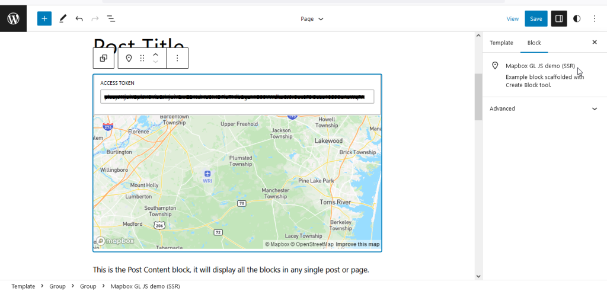
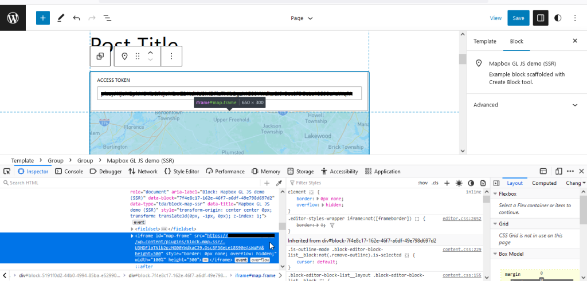
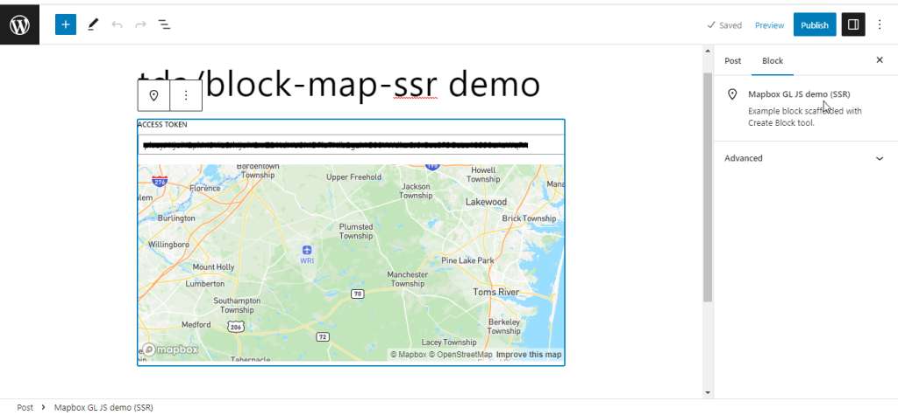
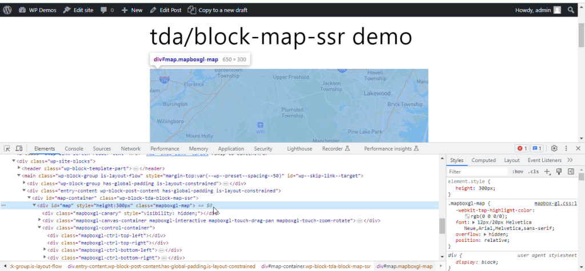

## Sample editor & front-end/non-admin previews

This was WordPress v6.2.2 with Twenty Twenty-Three v1.1, and I used Firefox.

* Screenshot 1 – the FSE/Site editor screen at `wp-admin/site-editor.php`:
  

* Screenshot 2 – same location as the above, but with the Firefox's Inspector tab shown:
  

As for the following screenshots, I used Chrome.

* Screenshot 3 - the post editing screen (at `wp-admin/post.php`):
  

* Screenshot 4 - the above post's preview (front-end/non-admin):
  

## Try the plugin (for quick testing)

You can download it [here](https://www.dropbox.com/s/wzo59py7k0wllbw/block-map-ssr.zip?dl=0). It uses the *non-minified* build scripts, which you can also find in the [`build`](./build) folder in this repo.
